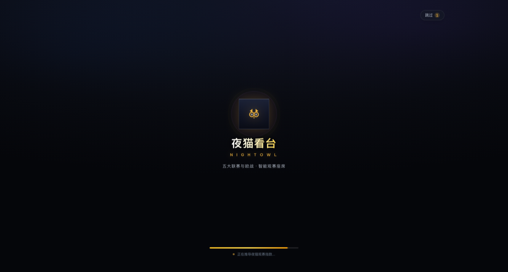
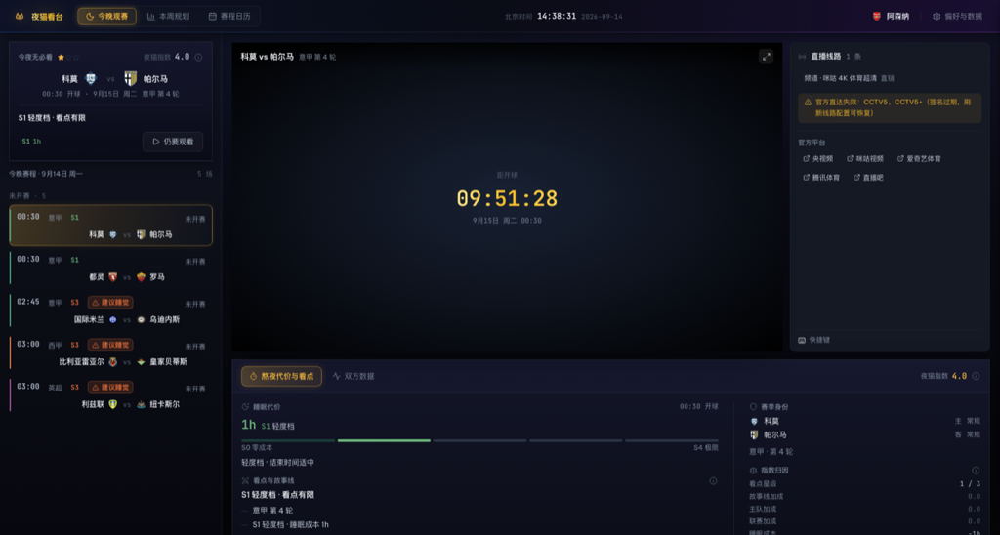
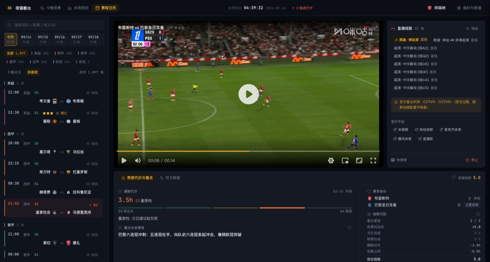
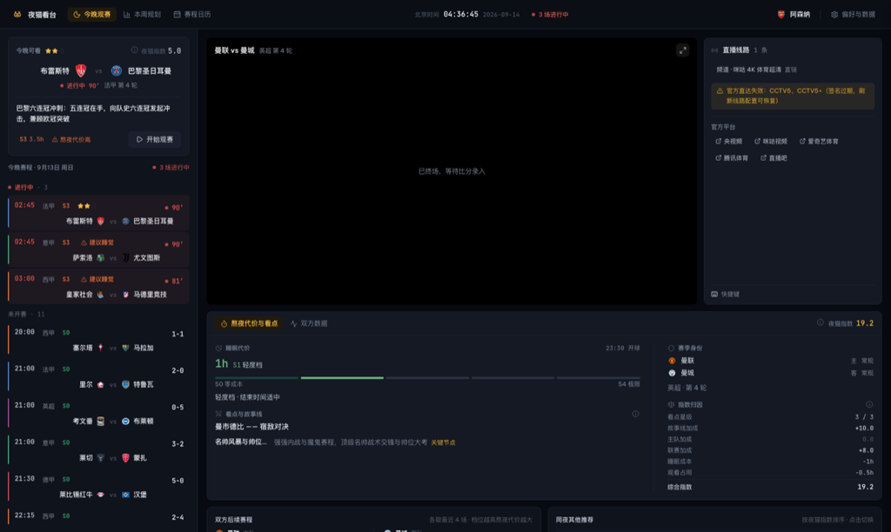

<div align="center">
  

  # 夜猫看台 · Owl Terrace

  **熬夜看球之前，先让算法替你算一算 —— 今晚该看哪场、值不值得熬。**

  <sub>本机运行的观赛决策工作台 · 赛程 / 比分 / 情报 / 直播源，一个窗口看全</sub>

  <br />

  
  
  
  
  

  <br />

  <a href="../../releases/latest"><b>下载安装</b></a> ·
  <a href="#它解决什么问题">它解决什么</a> ·
  <a href="#功能">功能</a> ·
  <a href="#从源码运行">从源码运行</a> ·
  <a href="docs/DEVELOPMENT.md">开发文档</a>
</div>

<br />



---

## 它解决什么问题

欧洲五大联赛 + 欧战的比赛大量落在北京时间**凌晨 0 点到 4 点**。一个普通周末夜里会有十几场——全都看不可能，凭感觉挑又常常熬了一场 0-0。

这个工具把「值不值得熬夜」变成一个**可计算的决策**：

| 问题 | 它给出的答案 |
| :--- | :--- |
| 今晚这么多场，看哪场？ | **今晚之选**：按关注球队 → 看点星级 → 夜猫指数排序，给出唯一推荐和理由 |
| 这场要熬到几点？代价多大？ | **睡眠成本分档**：按开球时间自动分成 S0 零成本 ~ S4 极限五档，直接给小时数 |
| 有没有更划算的替代场次？ | **同夜推荐**：今晚其余场次按指数排序，一键切换 |
| 这周我能承受几场？ | **背包规划**：按每周睡眠预算做二维 DP，算出「最多能看哪几场」的最优组合 |
| 支持球队几天后还有什么？ | **双方后续赛程**：摆在当前比赛下方，判断要不要战略性放弃 |

> 核心不是「聚合更多比赛」，而是**帮你少熬几场、且熬的那几场不后悔**。

---

## 功能

### 🧠 决策大脑（纯函数算法，可回归测试）

- **今晚之选** —— 关注球队优先（硬比较），依次看点星级、夜猫指数
- **夜猫指数** —— 综合看点、德比权重、时间档位、关注加成，量化为可直接比较的分数
- **睡眠成本分档** —— 运行时按开球时间计算（S0 白天 / S1 轻度 / S2 中度 / S3 重度 / S4 极限），不读数据里的静态字段，改时间不会失真
- **背包规划** —— 每周睡眠预算下的二维动态规划，输出最优观赛组合
- **看点三层供给** —— L1 人工精修（每周 1–2 条核心场次）/ L2 规则合成（德比、争冠、连败等）/ L3 通用兜底，永不空窗

### 💾 数据自己会更新

- **比分保鲜（多源合并）** —— ESPN 为主源、openfootball 为副源，交叉折算后写入本地；两源都缺的场次会被明确标为「上游未提供」，而不是让你猜
- **智能同步范围** —— 只扫描确实存在缺口的月份（通常 1–2 个月），一次同步约 15 秒
- **自动保鲜** —— 应用启动后自动跑一次，之后每 30 分钟按需检查
- **数据落点分级** —— 内置快照（只读出厂数据）+ 用户数据目录（可写），升级覆盖安装不丢比分
- **防剧透** —— 已结束场次默认只显示「揭晓」，点开才看比分

### 🎬 观赛链路（本机代理）

- **直播源自动抓取与对齐** —— 从聚合站多镜像抓取房间信息，按**双方队名全等匹配**对齐到本地赛程（宁缺勿错：匹配不到只是没有直链，配错是把错误内容当正确结果交付）
- **本地流代理** —— 只监听 `127.0.0.1`；白名单授权、M3U8 全量 URI 重写（覆盖 10 类载体）、Range 透传、并发闸门、会话授权 TTL 回收
- **三层超时** —— 等响应头 / 流静默（直播流本就该跑几小时，用空闲超时而非总时长）/ 排队超时，任何一层缺失都可能被上游僵住拖死
- **官方平台直达** —— 央视频、咪咕、爱奇艺体育、腾讯体育、直播吧，一键跳转系统浏览器
- **内联播放器** —— hls.js + ArtPlayer，懒加载（首屏不背播放器的体积）

### 📅 浏览与组织

- **今晚观赛** —— 按状态分区：进行中（置顶带呼吸灯）/ 未开赛 / 已结束（默认折叠）
- **赛程日历** —— 日期导航条（今天排第一、有比赛的日子带场次数）+ 当日比赛按联赛分组；「全部」保留全季 1897 场的检索视图
- **本周规划** —— 周视图 + 睡眠预算下的背包建议 + 雷区预警
- **比赛情报** —— 决策视角（熬夜代价 / 看点与故事线 / 指数归因）与数据视角（近 5 场走势 / 赛季攻防 / 历史交锋，**全部来自真实已完赛场次，无虚构**）

---

## 界面

### 今晚观赛 —— 分区 + 唯一推荐



### 赛程日历 —— 日期条 + 联赛分组



### 比赛情报与后续赛程



### 决策视角与数据视角


---

## 快速开始

### 下载安装（推荐）

前往 [Releases](../../releases/latest) 下载 `NightOwl-Terrace-Setup-<版本>.exe` 安装。

- 系统要求：Windows 10 / 11（x64）
- 首次启动会播放一次开屏动画（可跳过）
- **比分自动保鲜**：启动后会自动拉取最新比分，无需手动操作；数据更新时间与待录场次可在「设置 → 数据与服务」查看
- 应用内更新：从 v0.1.8 起，新版本会在应用内提示并支持一键下载安装

### 从源码运行

```bash
git clone https://github.com/LuckyOneTwoThree/nightowl-web.git
cd nightowl-web

npm install
npm run dev        # 开发模式：127.0.0.1:5173（/api 代理到 3100）
# 或者
npm run build && npm run server   # 生产构建 + 本地服务：127.0.0.1:3100

npm run electron:dev               # 以 Electron 桌面外壳启动
```

> 前端与本地服务跑在同一个 127.0.0.1 上。服务只监听本机，不对外提供任何端口。

---

## 项目结构

```
src/
  core/          算法与数据层（唯一权威实现，Node 可直接测）
    engine.js      ★ 算法核心：今晚之选 / 夜猫指数 / 睡眠分档 / 背包规划
    owl.js         应用层视图模型（今晚 / 本周 / 赛程 / 单场评估）
    stats.js       真实数据统计（近况 / 赛季攻防 / 历史交锋）
    media.js       媒体类型判定（显式 kind，不靠 URL 嗅探）
  data/          6 项数据资产（赛程 / 球队 / 德比 / 故事线 / 推荐 / 队徽）
  components/    UI 组件（TopBar / HeroCard / MatchRow / IntelPanel / Player …）
server/
  index.js       本地服务入口（强校验只绑定 127.0.0.1）
  proxy.js       流代理（白名单 / 会话授权 / Range / 并发闸门）
  m3u8.js        M3U8 全量 URI 重写（10 类载体）
  scores.js      比分保鲜（多源合并 → 补丁；只写 sched/done/pp）
  scraper.js     直播源抓取与队名对齐
  sources/       多源适配层（espn 主源 + openfootball 副源）
electron/        桌面外壳（CJS 主进程 + preload 最小桥 + 自动更新）
tools/           数据迁移 / 保鲜同步 / 别名生成 / 13 个测试脚本
spike/           算法基线验证（移植期与原版交叉比对）
```

---

## 工程约定

这是一个「个人工具」形态的项目，但在几个容易出错的地方刻意上了机制，而不是靠自觉：

- **单一权威源**：做什么看 PRD、显示什么数据看对账表、算法只有 `engine.js` 一处实现（`spike/` 直接引用它，不留副本）
- **算法零偏差**：迁移期在 1,897 场真实赛程上与原版逐场交叉比对，0 处偏差后才继续
- **时区口径**：数据时间为北京墙钟，全部换算走纯 UTC 算术（禁用设备本地时区解析）
- **状态只落三值**：`sched` / `done` / `pp`，进行中状态运行时推导，避免落库状态与真实时间打架
- **打包自检**：跨平台 node 脚本扫描产物内的相对 import 与运行时依赖，本地与 CI 共用同一份逻辑（开发环境是 mac，CI 是 Windows——验证脚本必须两边都能跑）
- **测试即验收**：13 个测试脚本 / 271 项断言，`npm run test:all` 串行跑完（含错配零容忍的直播源匹配回归）

详见 [docs/DEVELOPMENT.md](docs/DEVELOPMENT.md)。

---

## 免责声明

- 本项目**不提供、不托管、不存储、不转码**任何直播视频内容，也不含任何直播源地址
- 直播源信息来自第三方公开索引，其可用性、合法性由来源方负责；本项目仅按用户要求在本机做格式转发
- 本地服务**只监听 127.0.0.1**，不向局域网或公网提供任何服务
- 请仅将本项目用于**个人学习与技术研究**，遵守所在地区法律法规及相关内容平台的用户协议
- 项目内所有比赛数据、球队名称与队徽版权归各自权利人所有

---

## 许可

本仓库目前**未指定开源许可证**（默认保留所有权利）。如需转载或复用其中的代码思路，请先开 Issue 说明用途。

<div align="center">
  <sub>用 ❤️ 和很多个凌晨做出来的 —— 愿你的每一次熬夜都值得。</sub>
</div>
